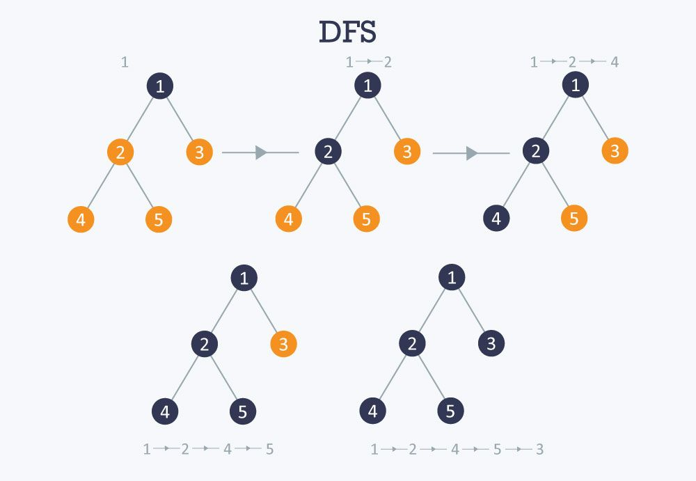
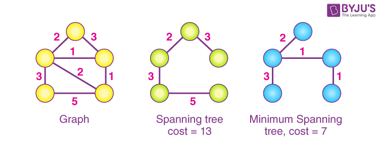

# Algorithms

## Algorithms to Know

1. BFS
2. DFS
3. Dijkstra’s
4. Kruskal’s MST
5. Prim’s MST
6. Topological Sort
7. Selection Sort
8. Quick Sort
9. Merge Sort

For each algorithm below you'll find:

- What it does and when to use it
- Time and space complexity
- Concrete step-by-step walkthrough (small example)
- Core data structures it uses

---

### 1) Breadth-First Search (BFS)

a. What it does / when to use it

- Explores a graph level-by-level from a start node.
- Use BFS to find the shortest path in an unweighted graph, to check connectivity, or to compute levels (distance in number of edges) from a source.

b. Complexity

- Time: O(V + E)
- Space: O(V) (queue + visited set)

c. Specific steps (walkthrough)

- Start at node A. Mark A visited and enqueue it.
- Steps:
  - While queue not empty:
  - dequeue node u
  - visit its neighbors v that are not visited: mark visited, record path, and enqueue v.

d. Data structures

- Queue (FIFO), visited set/map, optional hashmap for reconstructing paths.

---

### 2) Depth-First Search (DFS)

a. What it does / when to use it

- Explores as deep as possible along each branch before backtracking. Use DFS for cycle detection, topological sorting (when implemented with postorder), connected components, and exploring search spaces where you want to explore paths completely.

b. Complexity

- Time: O(V + E)
- Space: O(V) (recursion stack or explicit stack + visited)

c. Specific steps (walkthrough)

Recursive approach: visit node, mark visited, recursively visit each unvisited neighbor.

d. Data structures

- Recursion stack or explicit stack, visited set/map.

Notes: DFS does not guarantee shortest paths in terms of edge count.

---

### 3) Dijkstra's Algorithm

a. What it does / when to use it

- Finds shortest paths from a single source to all nodes in a graph with non-negative edge weights. Use Dijkstra for weighted shortest-path problems where weights are >= 0.

b. Complexity

- Using a binary heap (priority queue): O((V + E) log V) typically written O(E log V)
- Space: O(V) for distances and predecessor information

c. Specific steps (walkthrough)

- Initialize `distance[source]=0`, all others = ∞. Use a min-priority queue keyed by distance.
- Simple Explanation: Greedily take smallest tenative distance, update if we find shorter paths.
- Extract node u with smallest tentative distance; for each neighbor v of u relax the edge: if `dist[u] + w(u,v) < dist[v]`, update `dist[v]` and predecessor, and push/update `v` in the queue.

[Helpful Video (Can skip to 0:20)](https://www.youtube.com/watch?v=1PPfjBS58Go)

d. Data structures

- Min-priority queue (binary heap), distance vector/map, predecessor map, adjacency list for neighbors.

Restrictions: edges must have non-negative weights

---

### 4) Kruskal's Minimum Spanning Tree (MST)

> Recall that a Minimum Spanning Tree (MST) is the cheapest way (lowest total edge weight) to connect all nodes (vertices) in a weighted, connected graph without creating any cycles

a. What it does / when to use it

- Computes an MST for a connected, undirected, weighted graph by greedily selecting the smallest-weight edges that do not form a cycle.

b. Complexity

- Time: O(E log E) for sorting edges
- Space: O(V) for union-find structures and output MST edges

c. Specific steps (walkthrough)

- Sort all edges ascending by weight.
- Initialize a disjoint-set (union-find) with each vertex in its own set.
- Have some function `find(N)` that returns which tree a node `N` is in.  
- Iterate sorted edges: for edge `(u,v,w)`, if `find(u) != find(v)` then `union(u,v)` and include edge in MST.
- Continue until MST has `V-1` edges.

d. Data structures

- Edge list (sorted), Union-Find (disjoint-set) data structure with path compression and union by rank.

[Helpful 2 Minute Video](https://www.youtube.com/watch?v=71UQH7Pr9kU)

---

### 5) Prim's Minimum Spanning Tree (MST)

a. What it does / when to use it

- Grows an MST from a starting vertex by repeatedly adding the cheapest edge connecting the growing tree to a new vertex. Can be more efficient for dense graphs.

b. Complexity

- Time Complexity using a binary heap + adjacency list: O(E log V)
- Space: O(V)

c. Specific steps (walkthrough)

- Pick arbitrary start vertex; mark it in the MST set.
- Maintain a min-priority queue of candidate edges keyed by edge weight.
- Repeatedly extract the smallest edge that connects the tree to a new vertex, add that vertex and update candidate edges for its neighbors.

d. Data structures

- Priority queue (min-heap), adjacency list or matrix, vectors to track best edge/weights and whether a vertex is in the MST.

[Helpful 2 Minute Video](https://www.youtube.com/watch?v=cplfcGZmX7I)

> **NOTE**: You only need to master (know specific steps) of 1 of the MST algorithms, but you should know the names, data structures, and time/space complexity of each

---

### 6) Topological Sort

a. What it does / when to use it

- Produces a linear ordering of nodes in a directed acyclic graph (DAG) such that for every directed edge `(u, v)`, `u` appears before `v`. Use it for scheduling tasks with prerequisites, build systems, and course ordering.

b. Complexity

- Time: O(V + E)
- Space: O(V)

c. Specific steps (walkthrough)

- Perform a Depth First Search (DFS) on the Directed Acyclic Graph (DAG) and
- for each vertex:
  - push it onto a stack only after visiting all its adjacent vertices. This ensures that every vertex appears after all its neighboring vertices.
- Finally, reversing the stack (or popping elements from it) gives the topological ordering of the graph.

d. Data structures

- In-degree vector/map, stack, adjacency list.

[Helpful Video, Can Skip to 1:05](https://www.youtube.com/watch?v=7J3GadLzydI)

---

### 7) Selection Sort

a. What it does / when to use it

- Simple comparison-based sorting algorithm that repeatedly selects the minimum (or maximum) element from the unsorted portion and moves it to the end of the sorted portion. Use primarily for teaching or tiny vectors where simplicity matters; not used in production for large n.

b. Complexity

- Time: O(n^2) comparisons and O(n) swaps
- Space: O(1) extra space (in-place)

c. Specific steps (walkthrough)

- For i from 0 to n-2: find index minIndex of smallest element in A[i..n-1], swap A[i] and A[minIndex].
- Example: A=[4,2,7,1]
  - i=0: min=1 at index 3 -> swap -> [1,2,7,4]
  - i=1: min=2 at index 1 -> swap (no-op) -> [1,2,7,4]
  - i=2: min=4 at index 3 -> swap -> [1,2,4,7]

d. Data structures

- vector; uses indices and constant extra variables.

---

### 8) Quick Sort

a. What it does / when to use it

- Divide-and-conquer sorting algorithm that partitions an vector around a pivot, recursively sorts partitions. Use Quick Sort for average-case fast in-memory sorting; it's often the fastest practical comparison sort.

b. Complexity

- Average time: O(n log n)
- Worst-case time: O(n^2) (bad pivot choices)
- Space: O(log n) expected recursion depth (in-place partitioning); O(n) worst-case recursion depth.

c. Specific steps (walkthrough)

- Choose a pivot (first, last, random, median-of-three). Partition vector into elements < pivot, pivot, and > pivot (in-place schemes like Lomuto/Hoare). Recursively sort the two partitions.
- Example: A=[3,6,2,7,5], choose pivot 5
  - partition -> [3,2,5,6,7] (positions left of pivot <5, right >5)
  - recurse on [3,2] and [6,7] etc.

d. Data structures

- vector in-place, recursion stack. Partitioning uses index pointers.

Notes: Randomized pivot or median-of-three reduces the chance of worst-case; quicksort is not stable unless implemented carefully.

---

### 9) Merge Sort

a. What it does / when to use it

- Divide-and-conquer sorting algorithm that splits the vector in half, recursively sorts each half, and merges the sorted halves. Use when stable sort is required or predictable O(n log n) worst-case performance is important; good for external sorting and linked lists.

b. Complexity

- Time: O(n log n) worst/average/best
- Space: O(n) extra space for vectors (merge buffers).

c. Specific steps (walkthrough)

- Recursively split the vector until subvectors of size 1. Merge pairs of sorted subvectors by repeatedly taking the smaller head element and writing it to the output vector.
- Example: A=[4,1,3,2]
  - split [4,1] and [3,2]
  - split further to [4],[1] and [3],[2]
  - merge [4] and [1] -> [1,4]; merge [3] and [2] -> [2,3]
  - merge [1,4] and [2,3] -> [1,2,3,4]

d. Data structures

- vectors, temporary buffer/vector for merging, recursion stack.

Notes: Merge sort is stable and has reliable performance; useful when worst-case guarantees or stability are needed.

---

## Fair-Game / Conceptual Questions (examples)

- Given a graph and asked for the shortest path in an unweighted graph from A to E, use BFS and reconstruct the path.
- Order classes to satisfy prerequisites use Topological Sort on the prerequisite DAG.
- What is the time and space complexity of Prim's MST
- True/False: Kruskal's MST uses a Binary Heap

## Not Fair-Game

- Writing code is intentionally excluded from the conceptual questions — focus on the algorithmic steps, trade-offs, and when to pick each approach.

---
