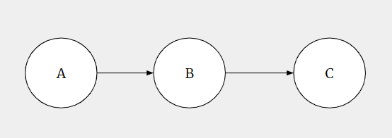
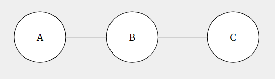
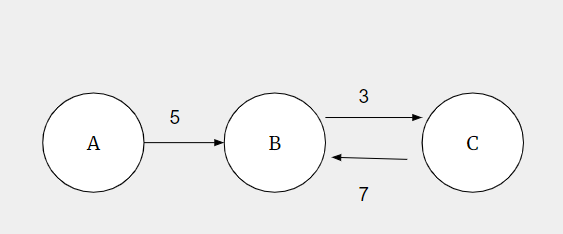
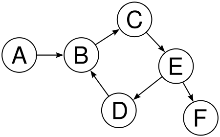

# Graphs

> Graphs are a non-linear data structure that represent relationships between objects using nodes (or vertices) and edges (or links)

## Types of Graphs (Vocab)

Directed Graph:



Undirected Graph:



**Weighted Graph**

Definition: Any graph where each edge is assigned a numerical value, or "weight," which can represent a cost, distance, or other metric

Can be Directed (With Potentially Different Weights for Different Directions)



Or Undirected


**Unweighted Graphs**

A graph without weights is literally just the graphs we saw before, don't overthink it!

**Cyclic Graph**: Any graph that has a cycle

Cycles may be long:



Or as short as two elements.


**Acyclic Graph**: Any graph that doesn't have a cycle

**Directed Acyclic Graph (DAG):** Any directed graph that doesn't have a cycle

> Note: These are all overlapping definitions. A DAG is an acyclic Graph, and is a Directed Graph, and may be weighted or unweighted

Trees (as graphs)


> 💡 What vocab words can we use to describe a tree?

## Graph

### List of edges: INVALID

Maintain a list of each edge `(u, v)` in a graph. This is enough to cover MOST information but not ALL. If a node is not connected to any other nodes, it would be dropped from our representation.

### List of notes: INVALID

Maintain a list of each node `V` in the graph. This just doesn't give any information to encode edge relationships, so this also isn't enough

### Adjacency List

An adjacency list represents a graph as a mapping from each vertex to a list (or set) of its neighbors. It's typically implemented with a dictionary (or hash map) keyed by node IDs pointing to arrays/lists of adjacent nodes. For weighted graphs, store pairs `(neighbor, weight)`.

Example Directed Graph (Python, string node ids):

```python
graph = {
 'A': [('B', 5), ('C', 2)],
 'B': [('A', 5), ('D', 1)],
 'C': [('A', 2)],
 'D': [('B', 1)],
}
```

Example Unweighted Graph (Python):

```python
graph = {
    'A': ['B', 'C'],
    'B': ['A', 'D'],
    'C': ['A'],
    'D': ['B']
}
```

> Note: **Undirected graphs** are just stored as **directed** graphs, and whenever you add edge `u, v` to the adjacency list, also add edge `v, u`.

- **Strengths:** memory-efficient for sparse graphs (O(V + E)), fast to iterate over neighbors, natural for DFS/BFS and most graph algorithms (Dijkstra, topological sort).
- **Weaknesses:** checking if an edge (u, v) exists may be O(deg(u)); not ideal for extremely dense graphs where adjacency queries need to be constant time.
- **When to use:** real-world networks (social/follow graphs), road networks, algorithm implementations where iterating neighbors is common.

### Adjacency Matrix

An adjacency matrix is a 2D array (matrix) of size `V x V` where `matrix[u][v]` indicates the presence (and optionally weight) of an edge between `u` and `v`. Node IDs are typically mapped to integer indices.

Example (Python, unweighted):

```python
n = 4
matrix = [[0]*n for _ in range(n)]
# add directed edge 0 -> 1
matrix[0][1] = 1
# add weighted edge 1 -> 2 with weight 7
matrix[1][2] = 7
```

- **Strengths:** O(1) time to check if an edge exists, simple linear algebra operations (matrix powers give counts of paths), compact for dense graphs.
- **Weaknesses:** uses O(V^2) memory which is prohibitive for large sparse graphs; iterating neighbors is O(V) rather than O(deg(v)).
- **When to use:** small graphs, dense graphs, algorithms that rely on matrix operations (e.g., some network analysis tasks), or when constant-time edge queries are required.
